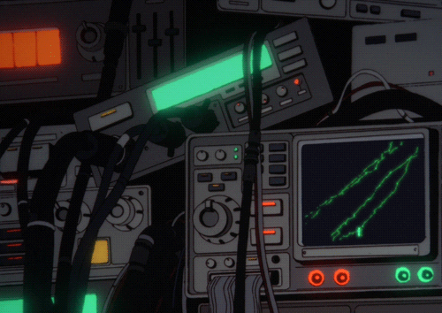

  
  

<h3 align="center" >A second year CSE student who likes anime and computers :) </h3>
 

  
  
  

 
 
 

  

    
    
    
    
    
    
    
      
    
    
    
         
    
    
    
          
  

